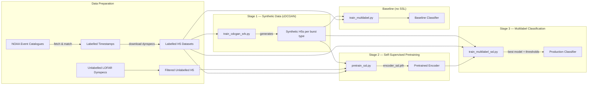

<div align="center">

# 🔭 LOFAR AI Detection System for ASTRON

### *Automated Multi-Label Classification of Solar Radio Bursts from LOFAR Dynamic Spectra*

---

> **Can an AI learn to "see" solar radio bursts — even the rarest ones — from raw LOFAR spectrograms?**
>
> This repository contains the full research pipeline that answers *yes*: a self-supervised learning framework that leverages thousands of **unlabeled** observations alongside a small labeled dataset and GAN-generated synthetic data to build a state-of-the-art **multi-label classifier** for 7 classes of solar radio phenomena.

</div>

---

## 🌌 The Challenge

[LOFAR](https://www.astron.nl/telescopes/lofar/) (the LOw-Frequency ARray), operated by ASTRON, produces a torrent of dynamic spectra — 2D time-frequency images that capture the rich, transient signatures of the Sun's radio emission. Among these are **solar radio bursts (SRBs)**: brief, energetic events tied to solar flares, coronal mass ejections, and space weather.

Classifying these bursts by hand is:

- **Slow** — thousands of spectrograms per observation campaign.
- **Subjective** — experts can disagree on faint or overlapping burst types.
- **Incomplete** — rare burst types (e.g., Type 4, Type 5) have very few labeled examples.

This project attacks all three problems with a **four-stage AI pipeline**:

```
┌──────────────────────┐      ┌──────────────────────┐      ┌──────────────────────────────┐      ┌──────────────────────────────┐
│  Stage 1: NOAA & GAN │ ───▶ │  Stage 2: SimCLR     │ ───▶ │  Stage 3: Multilabel         │ ───▶ │  Stage 4: Test               │
│  Label & Syn Data    │      │  Self-Supervised     │      │  Fine-Tuned Classifier       │      │  Evaluation on Test Set      │
│  Generation          │      │  Pretraining (SSL)   │      │  (7-class, per-class thresh.)│      │                              │
└──────────────────────┘      └──────────────────────┘      └──────────────────────────────┘      └──────────────────────────────┘
```


## 🧠 Why Self-Supervised Learning?

> **The core insight:** labeling LOFAR dynamic spectra is expensive and rare events are severely under-represented. SSL lets us learn powerful visual features from **all** available data — labeled, unlabeled, and synthetic — *before* we ever look at a single label.

### What the SSL Model Delivers

| Capability | Detail |
|:---|:---|
| **Rich Feature Representations** | The SimCLR encoder learns to extract meaningful spectral-temporal patterns from dynamic spectra *without supervision*, producing a 512-dimensional feature space that captures burst morphology, drift rates, and intensity structure. |
| **Twin-View Contrastive Learning** | For labeled data, the SSL stage pairs *filtered* and *unfiltered* views of the same observation as natural positive pairs — teaching the model that a burst is the same phenomenon regardless of RFI contamination level. |
| **Multi-Source Data Fusion** | SSL pretraining ingests *three* data streams simultaneously: (1) labeled train-split twins, (2) the full unlabeled LOFAR archive, and (3) GAN-generated synthetic bursts — maximizing the volume of spectrograms the encoder ever sees. |
| **Dynspec-Aware Augmentations** | Custom augmentation strategies (SpecAugment-style time/frequency masking, mild warp, jitter, optional Sobel edge channels) that respect the physics of dynamic spectra rather than applying generic image transforms. |
| **Strict Data Hygiene** | Validation and test labeled indices are **never** seen during SSL pretraining — guaranteeing unbiased downstream evaluation. |
| **Transfer to Downstream Tasks** | The pre-trained encoder weights serve as initialization for the multilabel classifier, dramatically improving convergence speed and final performance, especially on rare classes. |

---

## 🏗️ Pipeline Architecture



---

## 📂 Repository Structure

### 🐍 Core Training Scripts

| File | Purpose |
|:---|:---|
| [`pretrain_ssl.py`](pretrain_ssl.py) | **Self-supervised pretraining (SimCLR).** Builds a multi-source SSL dataset from labeled twins (filtered + unfiltered views), unlabeled filtered dynspecs, and synthetic H5s. Trains a custom CNN encoder with an NT-Xent contrastive loss. Uses dynspec-aware augmentations (jitter, warp, SpecAugment, optional Sobel edges). Outputs `encoder_ssl.pth` — the pretrained backbone. |
| [`train_multilabel_ssl.py`](train_multilabel_ssl.py) | **SSL-initialized multilabel fine-tuning.** Loads the pretrained encoder from `pretrain_ssl.py`, freezes it during head warm-up, then progressively unfreezes deeper layers with layerwise learning-rate decay. Uses EMA weight averaging, asymmetric/focal/BCE loss options, class-balanced sampling, and per-class threshold optimization on validation. Evaluates on held-out unfiltered test data with per-class ROC-AUC, PR-AUC, and confusion matrices. |
| [`train_multilabel.py`](train_multilabel.py) | **Baseline multilabel classifier (no SSL).** A standalone YOLO-inspired CNN trained from scratch on the filtered labeled dataset + optional GAN augmentation. Serves as the **controlled comparison** to measure the SSL model's improvement. Uses focal loss, class-balanced sampling, early stopping, and per-class threshold tuning. |
| [`train_cdcgan_srb.py`](train_cdcgan_srb.py) | **Conditional DCGAN for synthetic burst generation.** Generates realistic LOFAR dynamic spectra conditioned on burst type (supports composite labels like Type 1+5, Type 3+5). Features hinge/WGAN-GP loss, R1 gradient penalty, feature matching, spectral normalization, minibatch stddev, DiffAug, EMA generator, FID tracking, and automated H5 export of synthetic datasets. |

### ⚙️ SLURM Batch Scripts (HPC Execution)

These scripts orchestrate training on **SURF Spider** (A100 GPU cluster). Each handles data staging to node-local SSDs, environment setup, and result sync.

| File | What It Runs |
|:---|:---|
| [`run_multilabel_ssl.sbatch`](run_multilabel_ssl.sbatch) | **Full SSL pipeline end-to-end:** (1) Runs `pretrain_ssl.py` on twins + unlabeled + synthetic data, then (2) runs `train_multilabel_ssl.py` for fine-tuning with the freshly trained encoder. Single-GPU A100, 40 GB RAM, 2-day wall time. |
| [`run_yolo_multilabel.sbatch`](run_yolo_multilabel.sbatch) | **Baseline training:** Runs `train_multilabel.py` with optional GAN augmentation. Single-GPU A100, 32 GB RAM. |
| [`run_cdcgan_srb.sbatch`](run_cdcgan_srb.sbatch) | **GAN training:** Runs `train_cdcgan_srb.py` to generate synthetic burst datasets. Dual-GPU A100, configured per burst type (e.g., Type 2, Type 4+14, Type 1+5/3+5). |

### 📁 Folders

| Folder | Description |
|:---|:---|
| `Jupyter Notebook files/` | **Exploratory analysis & data engineering notebooks.** Includes: extending the original 3-class dataset to 6/7 classes, appending additional Type 2 labels, RFI/background noise analysis, concatenating GAN-generated H5 files into the main dataset, and an initial baseline model prototype. |
| `Fetch data from NOAA/` | **Solar event catalogue ingestion.** Python scripts to query the NOAA solar event database, download event records (2022–2024), and clean the resulting JSON catalogues. These catalogues provide the ground-truth timestamps used to label LOFAR observations. |
| `Create Labelled_Dataset/` | **Label assignment pipeline.** Jupyter notebook and CSV outputs that match NOAA solar event timestamps to LOFAR observation windows, resolving multi-label assignments (e.g., a spectrogram containing both a Type 2 and Type 3 burst). |
| `Create Unlabelled_Dataset/` | **Unlabelled data processing pipeline.** Scripts and batch jobs to build, filter, and orient the unlabelled LOFAR dynamic spectrum dataset used during SSL pretraining. Includes `make_unlabelled_from_timestamps.py`, `filter_unlabelled.py`, `orient_unlabelled_unf.py`, and their corresponding `.sbatch` files. |

### 📄 Other Files

| File | Description |
|:---|:---|
| `Complete_labelled_LOFAR_dataset_visualised.ipynb` | Comprehensive visualization of the full labelled 7-class LOFAR dataset — all spectrograms rendered with burst-type annotations. |
| `dataset visualise.ipynb` | Quick-look dataset visualization and statistics notebook. |
| `download_and_compress_data_aditya.ipynb` | Pipeline for downloading raw LOFAR dynamic spectra and compressing them into analysis-ready H5 format. |
| `Checked_Verified_timestamps.xlsx` | Manually verified ground-truth timestamps for labeled observations. |
| `nvidia-hpc-sdk.def` | Singularity container definition for reproducible GPU environments on HPC clusters. |
| `requirements.txt` | Python dependencies (PyTorch, h5py, scikit-learn, etc.). |

---

## 🔬 The 7 Burst Classes

| Class | Type | Description |
|:---:|:---|:---|
| 1 | **Type I** | Noise storms — clusters of short, narrowband spikes associated with active regions |
| 2 | **Type II** | Slow-drifting emission from CME-driven shocks propagating through the corona |
| 3 | **Type III** | Fast-drifting bursts from electron beams traveling along open field lines |
| 4 | **Type IV** | Broadband continuum emission following large flares |
| 5 | **Type V** | Continuum following Type III bursts, at lower frequencies |
| 6 | **Nothing** | Spectrogram with no identifiable burst activity |
| 7 | **CASA / Sintillation** | Cassetopia A  |

> **Multi-label:** A single spectrogram can contain multiple simultaneous burst types (e.g., Type II + Type III during a solar flare), making this a **multi-label** classification problem — not a simple single-class task.

---

## 🚀 Quick Start

### Prerequisites

```bash
# Clone the repository
git clone https://github.com/AddyAde10/LOFAR-AI-detection-System-for-Astron.git
cd LOFAR-AI-detection-System-for-Astron

# Create virtual environment
python -m venv venv && source venv/bin/activate

# Install dependencies
pip install torch torchvision h5py numpy pandas scikit-learn matplotlib opencv-python scipy
```

### Run the Full SSL Pipeline (HPC)

```bash
# 1. Train cDCGAN to generate synthetic bursts for under-represented classes
sbatch run_cdcgan_srb.sbatch

# 2. Run SSL pretraining → fine-tuning (single job, end-to-end)
sbatch run_multilabel_ssl.sbatch

# 3. (Optional) Run baseline without SSL for comparison
sbatch run_yolo_multilabel.sbatch
```

### Run Locally (single GPU)

```bash
# SSL Pretraining
python pretrain_ssl.py \
  --h5_labeled_filtered labeled_filtered.h5 \
  --h5_labeled_unfiltered labeled_unfiltered.h5 \
  --h5_unlabeled_filtered unlabelled_filtered.h5 \
  --splits_npz splits.npz \
  --synth_h5 synthetic_type2.h5 synthetic_type4.h5 \
  --epochs 50 --batch 64 --img 224 224 --sobel

# Fine-tune with SSL encoder
python train_multilabel_ssl.py \
  --h5_labeled_filtered labeled_filtered.h5 \
  --h5_labeled_unfiltered labeled_unfiltered.h5 \
  --splits_npz splits.npz \
  --ssl_ckpt runs/ssl_pretrain/encoder_ssl.pth \
  --gan_h5 synthetic_type2.h5 \
  --labels 1 2 3 4 5 6 7 \
  --epochs 50 --batch 32 --sobel
```

---

## 📊 Results

### Main Performance Comparison

> **Primary metric** is reported as mAP (detection), accuracy (classification), or micro-F1. **SSL outperforms every other technique.** Per-class thresholds are listed in class order {Type1, Type2, Type3, Type4, Type5, Nothing(6), CasA(7)}. In general, a high threshold means the model has higher confidence for getting a correct prediction for that class.

<div align="center">

| Approach | Test Condition | Primary | μP | μR | μF1 | M-P | M-R | M-F1 | Subset Acc | Per-class Thresholds (T1,T2,T3,T4,T5,N6,T7) |
|:---|:---|:---:|:---:|:---:|:---:|:---:|:---:|:---:|:---:|:---|
| Wang et al. (BB) | Detection (BB, paper) | mAP=0.7990 | — | — | — | — | — | — | — | — |
| Zhang et al. (single-label) | Syn + L + C (paper) | Acc(L)=0.8747, Acc(C)=0.8659 | — | — | — | — | — | — | — | — |
| Baseline supervised | Unfiltered (raw) | Acc=0.8794 | — | — | — | 0.8312 | 0.7541 | 0.7745 | — | — |
| Supervised (no syn) | Filtered | μF1=0.8392 | — | — | 0.8392 | — | — | 0.4162 | 0.7188 | `[0.275, 0.396, 0.486, 0.523, 0.465, 0.403, 0.338]` |
| Supervised (fil+syn) | Filtered + Syn  | μF1=0.9013 | — | — | 0.9013 | — | — | 0.3543 | 0.8219 | `[0.336, 0.313, 0.429, 0.429, 0.283, 0.448, 0.316]` |
| Supervised (fil+syn) | Filtered | μF1=0.8100 | — | — | 0.8100 | — | — | 0.4045 | 0.6828 | `[0.292, 0.385, 0.430, 0.473, 0.304, 0.444, 0.466]` |
| Supervised (fil+unfil+syn) | Unfiltered (raw) | μF1=0.4643 | — | — | 0.4643 | — | — | 0.3160 | 0.0097 | `[0.134, 0.741, 0.106, 0.050, 0.058, 0.502, 0.050]` |
| **SSL (no syn)** | **Filtered** | **μF1=0.8610** | 0.8367 | 0.8868 | 0.8610 | 0.7557 | 0.8497 | 0.7905 | — | `[0.85, 0.75, 0.90, 0.90, 0.90, 0.55, 0.45]` |
| **SSL (+syn)** | **Filtered** | **μF1=0.8986** | 0.8958 | 0.9013 | 0.8986 | 0.8537 | 0.8291 | 0.8397 | 0.7835 | `[0.75, 0.80, 0.90, 0.80, 0.80, 0.70, 0.80]` |
| **SSL (+syn)** | **Unfiltered (raw)** | **μF1=0.8500** | 0.8126 | 0.8909 | 0.8500 | 0.7425 | 0.8223 | 0.7672 | 0.6921 | `[0.60, 0.75, 0.60, 0.20, 0.70, 0.75, 0.80]` |

</div>

> **Key takeaway:** SSL with synthetic augmentation on filtered data achieves the best overall μF1 of **0.8986** and macro-F1 of **0.8397**, substantially outperforming all supervised baselines and prior literature. Useage of reliable and practical scenario based metrics like F1 scores in this work guarantee a good deployable performance. 

---


## 🛠️ Technical Highlights

<details>
<summary><b>🧩 Custom Encoder Architecture</b></summary>

The backbone is a YOLO-inspired CNN featuring:
- **ConvBlock** layers with Conv2d → BatchNorm → SiLU activation
- **BlurPool** anti-aliased downsampling (replaces strided convolutions)
- **C2F** (Cross Stage Partial) blocks for efficient multi-scale feature fusion
- **SPPF** (Spatial Pyramid Pooling — Fast) for receptive field expansion
- Sobel edge detection as an optional second input channel

</details>

<details>
<summary><b>📐 Dynspec-Aware Augmentations</b></summary>

Unlike generic image augmentations, our transforms respect the time-frequency structure of dynamic spectra:
- **SpecAugment** — time and frequency band masking (simulates dropouts)
- **Mild Warp** — slight anisotropic scaling (simulates drift-rate variation)
- **Jitter** — gamma, contrast, brightness, and Gaussian noise (simulates calibration variation)
- **Sobel Edges** — optional second channel providing structural gradient information

</details>

<details>
<summary><b>⚖️ Handling Class Imbalance</b></summary>

Solar radio bursts follow a severe long-tail distribution. We combat this with:
- **cDCGAN synthetic data** — generating 1500+ samples per rare burst type
- **Asymmetric Loss / Focal Loss** — down-weighting easy negatives
- **Class-balanced weighted sampling** — ensuring every class is represented in each batch
- **Per-class threshold optimization** — tuning decision boundaries on validation data

</details>

<details>
<summary><b>🔒 Strict Train/Val/Test Separation</b></summary>

Data integrity is paramount:
- Splits are defined on **unfiltered** indices and shared via `.npz` files
- SSL pretraining uses **only** train-split indices (plus unlabeled + synthetic)
- Validation and test observations are **never** seen during pretraining or GAN training
- The same splits are used across all experiments for fair comparison

</details>

---

## 🖥️ Compute Infrastructure

| Resource | Specification |
|:---|:---|
| **Cluster** | SURF Spider (Netherlands) |
| **GPUs** | NVIDIA A100 (40/80 GB) |
| **Storage** | Shared project filesystem + node-local NVMe SSDs |
| **Container** | Singularity (`nvidia-hpc-sdk.def`) |
| **Scheduling** | SLURM with GPU-aware partitions |

---

## 📖 Citation

If you use this work, please cite:
Note - The paper is currently in the process of publishing. 

```bibtex
@misc{lofar_ai_srb_2026,
  author       = {Ade et al.},
  title        = {An AI-Driven Framework for Automated Identification and Classification of Solar Radio Bursts},
  year         = {2026},
  publisher    = {arXiv},
  howpublished = {\url{https://arxiv.org/abs/2604.08515}}
}
```

---

## 🤝 Acknowledgements

This project was developed in collaboration with [ASTRON](https://www.astron.nl/) — the Netherlands Institute for Radio Astronomy — and executed on [SURF Spider](https://www.surf.nl/en/services/spider) HPC infrastructure. Special thanks to the LOFAR solar observation team for providing the dynamic spectra datasets and expert-verified labels.

---

<div align="center">

*Built with ☀️ for solar physics and 🤖 for AI — at the intersection of radio astronomy and deep learning.*

</div>
